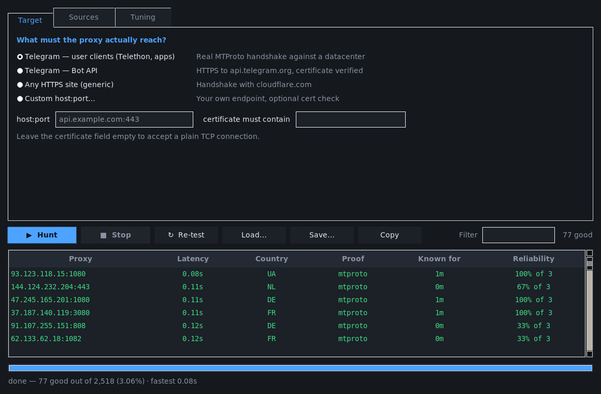

<h1 align="center">Sockrates</h1>
<p align="center"><i>Every proxy must prove itself.</i></p>

<p align="center">
  <a href="LICENSE"></a>
  
  
  
</p>

Sockrates finds open **SOCKS5** proxies and cross-examines each one until it demonstrates
that it reaches the target you actually care about — **Telegram included**, both MTProto and
the Bot API.

It runs in your terminal **and** as a desktop app. It has **no third-party dependencies**.

<p align="center"></p>

```console
$ sockrates --target telegram-mtproto --out live.txt
📥 collecting from 11 sources…
   2,518 unique in 0.6s
🎯 testing against 'telegram-mtproto' (149.154.167.51:443), strict
✅ 115 good out of 2,518 (4.52%) in 24.2s
   fastest 0.12s · median 1.82s
   9 have been working for over a day (oldest 3d)
💾 live.txt
```

---

## Why the name

Socrates never accepted a claim at face value, and neither does this. Finding proxies is
trivial — public lists hand you thousands in under a second. **Keeping the ones that work is
the entire problem**, and most scrapers get it wrong in two ways:

1. **They test against the wrong thing.** A proxy that loads `example.com` tells you nothing
   about whether it can reach *your* endpoint. Plenty of open proxies allow port 80 and
   refuse 443, or block particular networks outright.
2. **They believe the proxy.** A SOCKS5 server can answer *"connected!"* to anything and hand
   you a socket into the void. Any list built on that is padded with entries that fail the
   moment you use them.

Sockrates answers both. See **[How it works](docs/how-it-works.md)** for the full method.

| the claim | how Sockrates tests it |
|---|---|
| "I can reach your HTTPS endpoint" | completes the **TLS handshake through the proxy** and checks the certificate |
| "I can reach Telegram" | performs a **real MTProto handshake** — `req_pq_multi` in, valid `resPQ` back, carrying our nonce |
| "I'm a working proxy" | is also asked to connect somewhere **that must fail**; anything that reports success there is discarded as a liar |

How much does it matter? On the same 2,547 candidates:

| check | kept |
|---|---|
| TCP connect to a Telegram datacenter "succeeded" | 194 |
| …and Telegram actually answered | **115** |

**41% of them were lying.** Every result records how it was proven, in `verified`.

## Telegram is not one target

Bot API clients speak HTTPS to `api.telegram.org`. User clients — Telethon, the mobile apps —
open raw TCP to datacenter IPs and speak MTProto. **A proxy can allow one and block the other.**
From a single run of one list:

| works for | count |
|---|---|
| Bot API only | 36 |
| MTProto only | 152 |
| both | 42 |

Test for the one you will actually use. Details in **[Telegram targets](docs/telegram.md)**.

## What it hands you is alive

Free proxies rot within minutes. A list written an hour ago is mostly fiction, so Sockrates
never pretends otherwise:

- **`--watch N`** re-hunts every N minutes and rewrites your file, reporting how many died
  since the previous run. What is on disk was verified minutes ago at worst.
- **In the app**, *Re-verify before every Save / Copy* is on by default: the moment you export
  or copy, every row is tested again and the dead ones are dropped.
- **A track record.** No proxy tells you its uptime — there is no such field, and any list
  printing one is guessing. Sockrates instead remembers what it has observed: how long it has
  known each proxy to work, and how many of its checks it passed. Filter on it with
  `--min-age` and `--min-reliability`.

## Install

```bash
git clone https://github.com/SimuZSkyNeT/sockrates.git
cd sockrates
python3 sockrates.py --help
```

Python 3.9 or newer. Nothing to `pip install`. The desktop app needs Tkinter, which ships with
Python but some distributions split it out:

```bash
sudo apt install python3-tk      # Debian / Ubuntu
sudo dnf install python3-tkinter # Fedora
sudo pacman -S tk                # Arch
```

## Usage

```bash
# desktop app
python3 sockrates.py --gui

# Telegram user clients / Telethon
python3 sockrates.py --target telegram-mtproto --out mtproto.txt

# Telegram bots, certificate verified
python3 sockrates.py --target telegram-bot --out bots.txt

# anything else, with an optional certificate check
python3 sockrates.py --target api.example.com:443 --cert-contains example.com

# keep a file permanently true, refreshed every 10 minutes
python3 sockrates.py --target telegram-mtproto --watch 10 --out live.txt

# only proxies we have known to work for a day and that passed 80% of our checks
python3 sockrates.py --min-age 24 --min-reliability 80 --format csv --out proven.csv
```

Full reference: **[CLI](docs/cli.md)** · **[Desktop app](docs/gui.md)**

## Export formats

`--format` takes any of these, and the app offers the same list:

| format | what you get |
|---|---|
| `plain` | `ip:port`, one per line |
| `uri` | `socks5://ip:port` — curl, requests, `ALL_PROXY` |
| `csv` | host, port, latency, country, proof, known-for, reliability |
| `json` | full records |
| `proxychains` | a block to paste under `[ProxyList]` |
| `python` | a `PROXIES = [...]` list for PySocks / Telethon |
| `curl` | ready-made example commands |

## Responsible use

These are **other people's open proxies**, running on machines whose owners usually have no
idea. That carries obligations:

- Anything you send unencrypted can be read, logged or modified by the operator. **Use TLS
  end to end**, and never send credentials you would mind losing.
- Do not use them to attack, flood, or evade a ban you were given for good reason.
- Whether scanning and using open proxies is lawful **depends on where you are**. Check.

Sockrates only connects to hosts that already advertise themselves on public proxy lists, and
makes one short connection per check. It is a verifier, not a scanner: it does not sweep
address ranges looking for open ports.

## License

[Apache License 2.0](LICENSE). Permissive — use it commercially, fork it, embed it — with an
explicit patent grant, and no rights to the project name. See [NOTICE](NOTICE).
